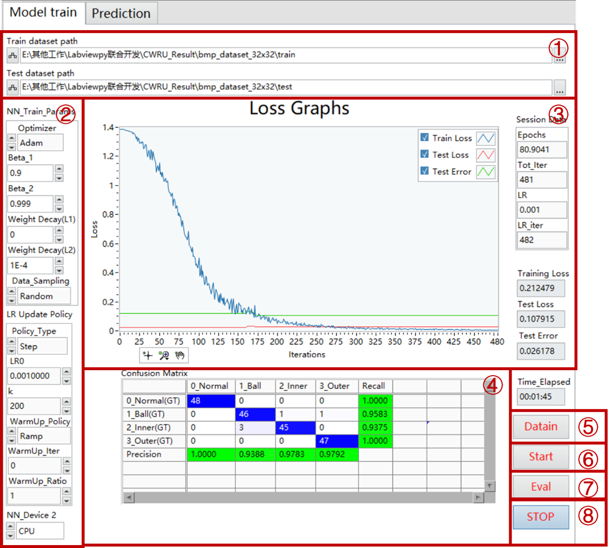
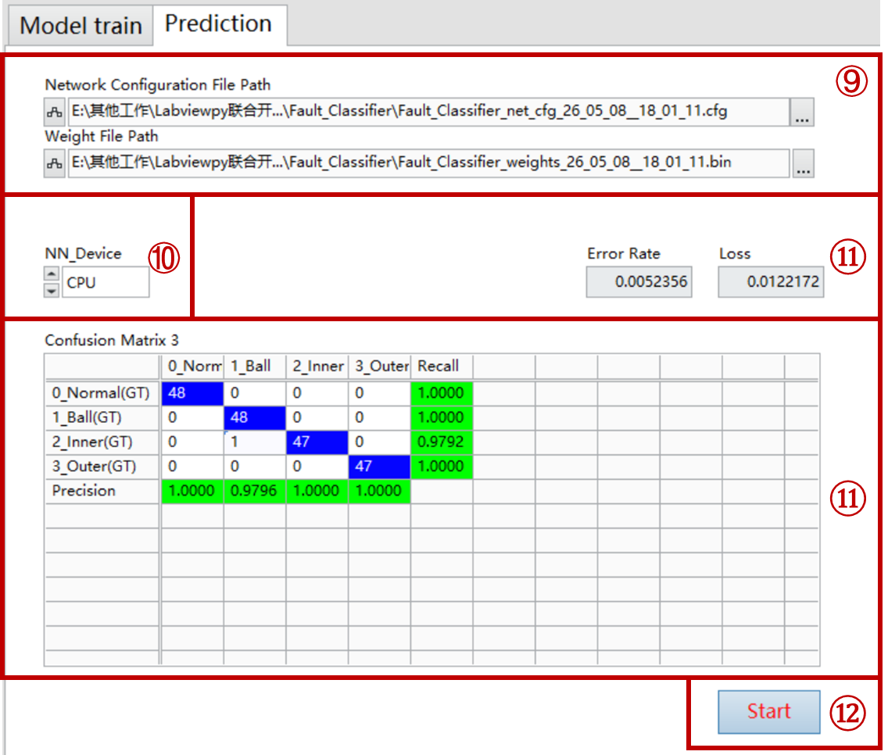

# LabVIEW DeepLTK Bearing Fault Diagnosis Demo
A LabVIEW DeepLTK demo for CNN-based bearing fault diagnosis using the CWRU dataset.

This repository provides a LabVIEW DeepLTK-based demo for intelligent bearing fault diagnosis using the CWRU bearing dataset. The demo demonstrates how to integrate a deep learning model into the LabVIEW environment through DeepLTK, including signal loading, CNN-based fault classification, prediction output, and diagnostic result visualization. The current version focuses on validating the feasibility of implementing deep learning-based bearing fault diagnosis within LabVIEW using DeepLTK.

## 1. Environment Requirements
- **Operating System:** Windows 10 / Windows 11, 64-bit recommended  
- **LabVIEW:** LabVIEW 2020 or later recommended  
- **Deep Learning Toolkit:** DeepLTK / Deep Learning Toolkit for LabVIEW  
- **Package Manager:** NI Package Manager or JKI VI Package Manager (VIPM)  
- **Dataset:** CWRU Bearing Fault Dataset  
- **Hardware:** No real-time DAQ hardware is required for the current offline demo

## 2. File Description

| File | Description |
|---|---|
| `README.md` | Project introduction file. It describes the purpose of the demo, environment requirements, usage instructions, and notes. |
| `bmp_dataset_32x32.rar` | Preprocessed CWRU bearing fault dataset used in this demo. The original one-dimensional vibration signals are converted into 32 × 32 BMP image samples for DeepLTK model training and testing. The dataset contains four classes: normal condition, inner race fault, outer race fault, and ball fault. Each image corresponds to one vibration signal segment, and each folder corresponds to one fault label. |
| `fault diagnosis.vi` | Main LabVIEW VI for the bearing fault diagnosis demo. It implements the DeepLTK-based diagnosis workflow, including data loading, model execution, and result display. |
| `model_prediction_interface.png` | Screenshot of the model prediction interface in LabVIEW. It shows the diagnosis interface and prediction result display. |
| `model_train_interface.png` | Screenshot of the model training interface in LabVIEW. It shows the DeepLTK model training process and related settings. |
| `working.rar` | Compressed DeepLTK trained model package. It contains the exported network configuration file `.cfg`, model visualization/render file, and trained weight file `.bin` generated after model training. |

## 3. Preparation Before Running
Before running the demo, please make sure that DeepLTK is correctly installed and that the dataset archive and required VI files have been downloaded.

## 4. Model Train Interface Usage

The model training interface is shown below.

  

The main operation steps are as follows:

**Step 1. Load dataset paths**  
   Set the paths of the training dataset and test dataset in Area ①, and then click the **Datain** button to load the data.

**Step 1. Configure training parameters**  
   Configure the optimizer, learning rate update policy, data sampling strategy, warm-up settings, and accelerator device in Area ②.

**Step 2. Start model training**  
   Click the **Start** button to begin training. During training, the training loss, test loss, and test error curves are displayed in real time in Area ③.

**Step 3. Validate the model**  
   Click the **Eval** button during or after training to evaluate the model performance. The confusion matrix, recall, and precision values are displayed in Area ④.

**Step 4. Monitor training status**  
   The current epoch, total iterations, learning rate, training loss, test loss, test error, and elapsed training time are displayed on the right side of the interface.

**Step 5. Stop and save the model**  
   After the loss has converged, click the **STOP** button. The trained network configuration and weights will be automatically saved as `.cfg` and `.bin` files in the following folder: `working/Fault_Classifier`.

## 5. Prediction Interface Usage

The prediction interface is shown below. It is used to load the trained DeepLTK model and evaluate its classification performance on the test dataset.

  

The prediction procedure is as follows:

**Step 1. Load trained model files** 
   In Area ⑨, load the two files generated after model training:
   Network Configuration File: `.cfg`
   Weight File: `.bin`

**Step 2. Configure the accelerator** 
   In Area ⑩, select the computation device used for prediction.

**Step 3. Start prediction** 
   Click the **Start** button in Area ⑫ to start the prediction and evaluation process.
   
**Step 4. View prediction results** 
   The prediction results will be displayed in Area ⑪.

## 6. Important Notes

- When using GPU for model training or prediction in DeepLTK, the LabVIEW project or related model files may become unstable or crash. For this demo, CPU mode is recommended for better stability.
- This project was developed using the trial version of the DeepLTK toolbox. Due to trial-version limitations, the number of parameters in each model layer is kept below 10,000.
- The CWRU dataset is selected mainly because it is relatively small, well-structured, and easy for the model to converge quickly during demonstration.
- The current CNN model is designed for fast validation of the LabVIEW DeepLTK workflow. Its performance on other datasets may be limited and should not be regarded as a general-purpose bearing fault diagnosis model.

